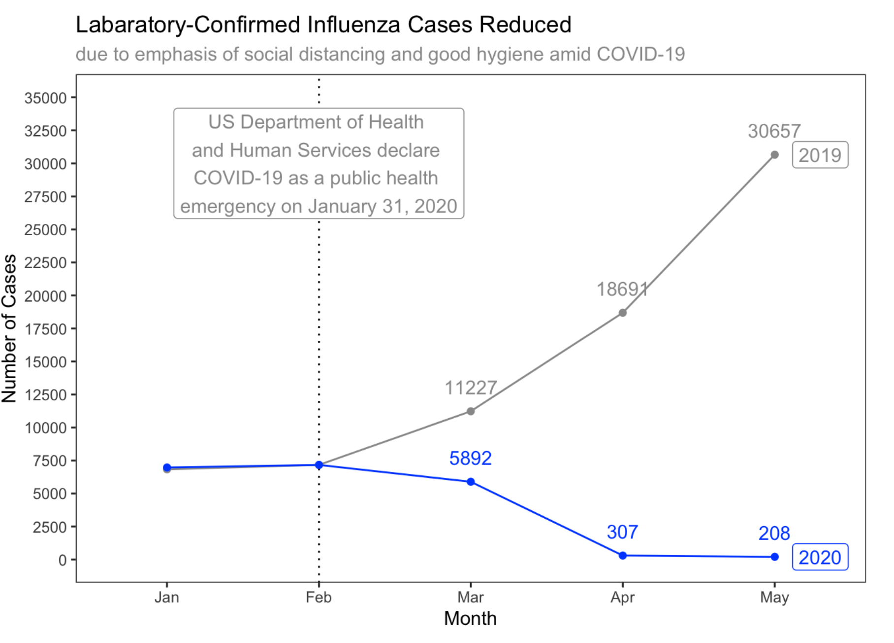

There were only 208 laboratory-confirmed cases of influenza nationwide in the month of May 2020 – compared to 30,567 at 
the same time in 2019.

I wanted to see if social distancing due to COVID-19 had a significant impact on these numbers. As a result, this study was done. 

After collecting some numbers from the Australian National Notifiable Diseases Surveillance System, I created a visualization 
in R using ggplot2. 
The visualization is a connected scatterplot, showing numbers from 2019 - 2020 during the flu season (Jan - May). Take a look at 
Rmd file to see how this was done! 

